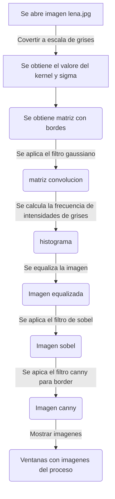

# Examen primer parcial Vision Artificial
La detección de bordes de canny es un algoritmo popular para este uso, fue desarrollado por John F. Canny, consta de varias fases, las cuales son:
1.  Reducción de Ruido
Debido a que la detección de bordes es suceptible al sonido en la imagen, el primer paso es remover el ruido en la imagen con un filtro Gaussiano.

2. Encontrar el Gradiente de la Intensidad de la imagen
La imagen suavizada se filtra con un kernel de Sobel, tanto horizontalmente y verticalmente, para obtener la primera derivada en la direccion horizontal (Gx) y vertical (Gy).
De estas dos imágenes, podemos encontrar el border gradiente y la dirección de cada pixel:

$$ EdgeGradient(G) = \sqrt{G_x^2+G_y^2}$$

$$ Angle(\theta) = tan^{-1}(G_y/G_x)$$

3. Supresión no Máxima
Despues de obtener la magnitud y dirección del gradiente, se hace un escaneo para remover pixeles no deseados que no sean el borde, para esto cada pixel se verifica para saber si es el máximo local en su vecindad en la dirección del gradiente.

  

4. Límites de Hysteresis
En este paso, se decide cuales bordes son realmente bordes. Para esto, se necesitan dos límites(min y max). Cualquier borde con un gradiente de intesidad mayor a max son realmente bordes y los bordes menores a min no son bordes, por lo cual se descartan. Los que estan en el medio se classifican como bordes o no dependiento de su conectividad.

  

## Diagrama

